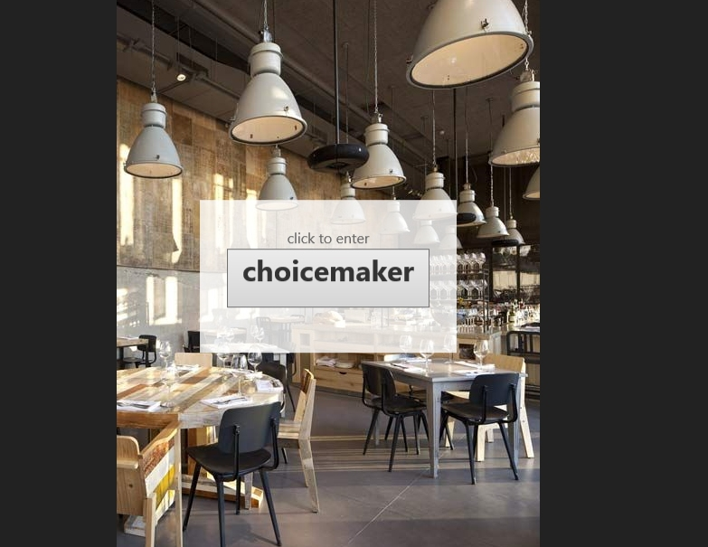
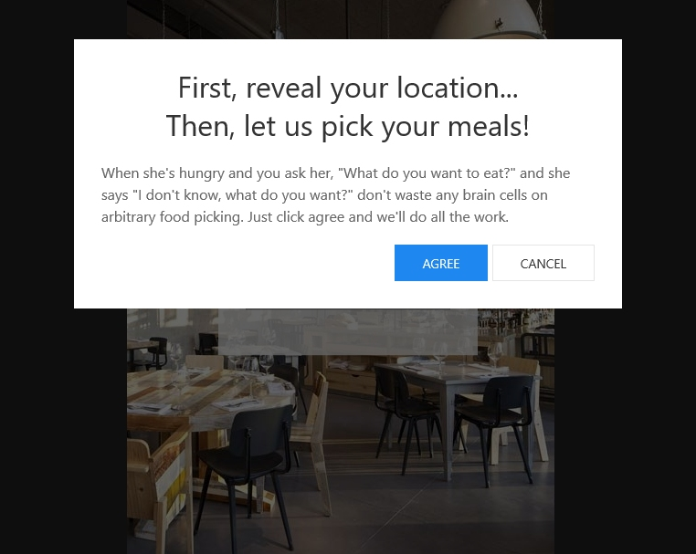
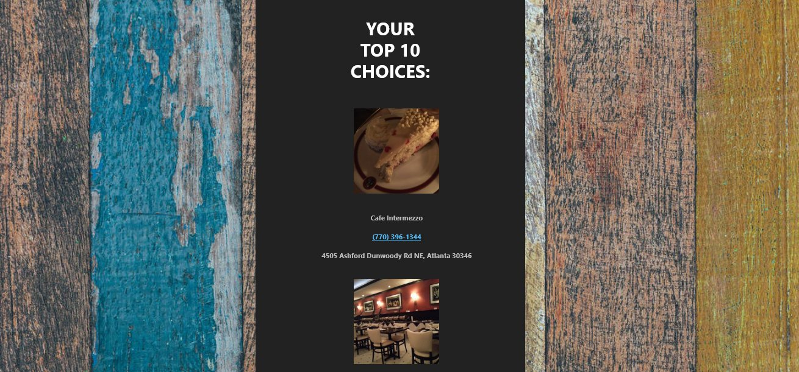
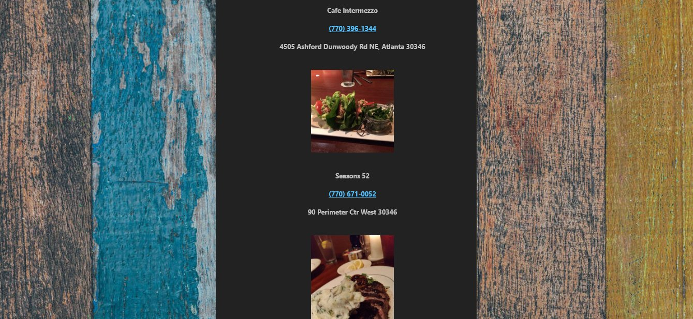
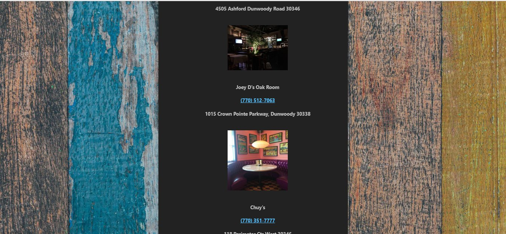
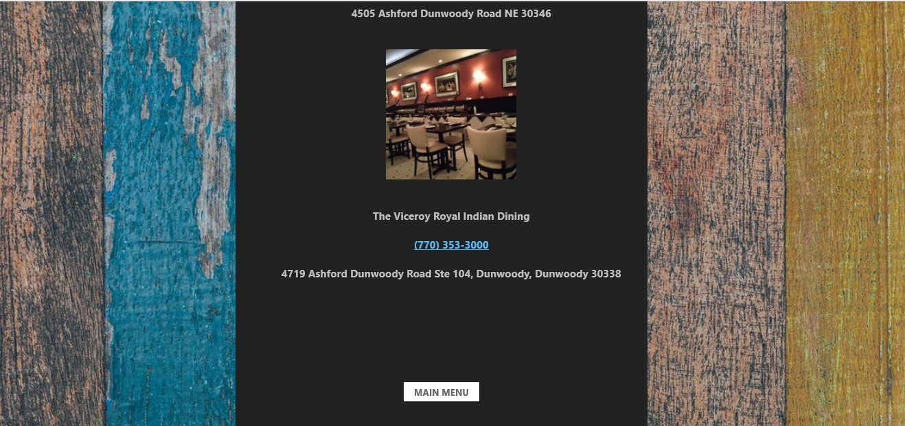

# GTBC---Project-1

https://leeyoh.github.io/GTBC---PROJECT-1/

## **Overview**

Welcome to Project 1! This is an important step in your full-stack journey as you will now use your newly acquired skills and knowledge to build web application from scratch. With your team, you will conceive and execute a design that solves a real-world problem by integrating data received from multiple server-side API requests. Because you will be working collaboratively, you will learn agile development methodologies and implement feature and bug fixes using the git branch workflow and pull requests.

### **Key Topics**

-Server-side APIs

-Git branching workflow

-Agile software development

### **Comprehension Check**

*You will be employer-ready if you can answer the following questions:*

-What is agile software development?

-What is an MVP?

-If you pull down a teammate's branch and you have merge conflicts, how do you handle it?

### **Learning Objectives**

*You will be employer-competitive if you are able to:*

-Speak technically about a feature you implemented in your project

-Explain and execute git branching workflow in a collaborative project

-Resolve merge conflicts

-Explain agile software development

-Design, build, & deploy a client-side web application using GitHub Pages

-Prepare a professional presentation & repository README for your project

### Screenshots of deployed app:

